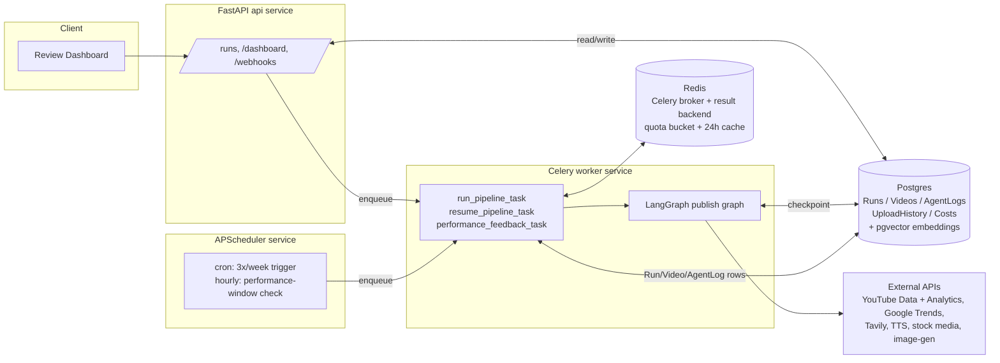

# AutoTube AI

A production-grade multi-agent system that autonomously researches YouTube trends, writes
*original* scripts, produces voiceover/visual/video assets, assembles final videos, generates
thumbnails, and publishes via the YouTube Data API v3 — governed end-to-end by critic/supervisor
agents for quality and policy compliance, with a human-approval gate before anything goes public.

> **Ground rule:** the system only researches existing YouTube content to find trends, gaps, and
> formats. It never copies, re-uploads, or closely imitates another creator's script, footage, or
> transcript. The Script QA critic hard-blocks on similarity/plagiarism before a script can
> proceed.

## Status: real logic landing stage by stage

The full pipeline is wired end-to-end (every node, every DB table, the FastAPI control API +
review dashboard, the Celery worker, the APScheduler cron process) — verified by running the
graph through the happy path, both critic retry loops, escalation, and the human-approval
interrupt/resume cycle. Real agent logic is being implemented one stage at a time on top of that
skeleton; stages not yet converted still return clearly-marked `[STUB]` placeholder data.

**Done — real logic:**
- **Trend Research Agent** (`graph/nodes/research.py::trend_research_node`) — pulls real YouTube
  "most popular" videos (`tools/youtube.py`, API-key auth), has an LLM cluster them into original
  content angles (never verbatim topics), then scores each candidate on objective, code-computed
  signals (view-count-derived competition, publish-date freshness, Google Trends rising/top query
  hits via `tools/trends.py` — live-tested against real Google Trends in this repo's dev history).
- **Strategy Agent** (`::strategy_node`) — LLM picks one candidate given channel goals and a real
  past-performance summary pulled from Postgres (`db/crud.py::summarize_recent_performance`,
  injected by `worker/tasks.py` at the Celery-task boundary so graph nodes stay DB-free).
- **Shared LLM client** (`core/llm.py`) — Claude Sonnet primary, GPT-4o-mini fallback, structured
  Pydantic output, used by both agents above and every future LLM-driven stage.

**Still stub:** Script Writer + Script QA critic, Fact-Check, Visual Planning + Asset sourcing,
Voiceover, Video Assembly, Metadata/SEO + Thumbnail, Compliance critic, Upload, Performance
Monitor + Learning.

## Architecture

### Pipeline (supervisor graph + worker + critic agents)


*(Notification Agent runs alongside every stage — Slack/Telegram/email alerts on critic
rejections, escalations, and failures — not shown as a pipeline node since it's cross-cutting.)*

### System components



### Two graphs, deliberately separate

- **Publish graph** (`graph/builder.py`) — the synchronous, per-run pipeline above. Compiled with
  a **Postgres-backed LangGraph checkpointer**, so a crashed worker resumes from the last
  completed node instead of restarting or double-uploading.
- **Feedback graph** (`graph/feedback_graph.py`) — `performance_monitor -> learning`, fired by the
  scheduler at the 24h/7d mark *after* a video is live. Kept separate because it runs on a delay,
  decoupled from the run that published the video.

## Repo layout

```
agents/schemas/   Pydantic I/O models for every worker + critic agent
graph/            LangGraph state, node stubs, supervisor graph, checkpointer
  nodes/          one module per agent group (research, script, visual, audio_render, publish, feedback, escalation)
api/              FastAPI app: control API (/api/runs) + review dashboard (/dashboard)
worker/           Celery app + tasks (executes the graph outside the request/response cycle)
scheduler/        APScheduler process — cron pipeline trigger + hourly performance-window check
db/               SQLAlchemy models, Alembic migrations, CRUD helpers
tools/            External API wrapper clients (YouTube, Trends, Tavily, TTS, stock media,
                  image-gen) + cross-cutting resilience/quota/cache/notify helpers
core/             Settings (pydantic-settings) + structlog config
docker/           Dockerfile (shared by api/worker/scheduler; command differs per service)
```

## Production-grade properties already in place

| Requirement | Where |
|---|---|
| Idempotent, resumable runs | `graph/checkpointer.py` (Postgres checkpointer) + `db.models.Run` per-run row with `stage_status`/`current_stage` |
| YouTube quota management | `tools/quota.py` — Redis token bucket, 10,000 units/day default, per-operation costs, `QuotaExceededError` propagates instead of silently over-spending |
| 24h result caching | `tools/cache.py`, used by `tools/trends.py` |
| Retry + circuit breaker on every external call | `tools/resilience.py` (`tenacity` exponential backoff + jitter, per-provider `CircuitBreaker`) wraps every function in `tools/youtube.py`, `tools/trends.py`, `tools/research.py`, `tools/tts.py`, `tools/stock_media.py`, `tools/image_gen.py` |
| Critic quality gate with bounded retries | `graph/builder.py` conditional edges: `critic_script_qa`/`critic_compliance` loop back up to `MAX_CRITIC_RETRIES` times, then route to `escalate_node` which notifies a human via `tools/notify.py` |
| Structured observability | `core/logging.py` (structlog) — every node call logs a structured event; `graph/state.py`'s `trace` accumulator captures the full run as a JSON timeline, persisted via `db/crud.persist_trace_as_agent_logs` into `AgentLog` |
| Cost tracking | `db.models.Cost` table (one row per stage/provider spend); `agents.schemas.common.StageCost` is the structured shape each node will report once real provider calls are wired in |
| Human-in-the-loop, toggleable | `graph/nodes/publish.human_approval_node` uses LangGraph `interrupt()`; `REQUIRE_HUMAN_APPROVAL=false` swaps in `auto_approve_node` at graph-build time |
| Scheduling decoupled from API | `scheduler/beat.py` is its own process/container, never started inside the FastAPI app |
| Secrets via env only | `core/settings.py` (pydantic-settings) + `.env.example` documents every key; nothing hardcoded |

## Setup

### 1. Prerequisites
- Docker + Docker Compose (recommended path), or Python 3.11+ and local Postgres 16 w/ pgvector + Redis for a bare-metal run.

### 2. Configure secrets
```bash
cp .env.example .env
# fill in: Anthropic/OpenAI keys, YouTube OAuth client + refresh token, Tavily, TTS provider,
# Pexels/Pixabay, image-gen provider, Slack webhook (optional), Postgres/Redis passwords.
```

### 3. Run with Docker Compose
```bash
docker compose up --build
```
This starts `postgres` (pgvector-enabled), `redis`, `api` (runs `alembic upgrade head` then
serves on `:8000`), `worker` (Celery), and `scheduler` (APScheduler, its own process).

- API docs: http://localhost:8000/docs
- Review dashboard: http://localhost:8000/dashboard/

> Note: this repo was scaffolded and verified in an environment without a running Docker daemon
> available for a full container build/integration test. `docker compose config` validates the
> compose file syntactically and `docker compose build api` was confirmed to build correctly;
> the full `docker compose up` integration run should be your first sanity check in an
> environment with Docker actually running.

### 4. Local (non-Docker) dev loop
```bash
python -m venv .venv && source .venv/Scripts/activate   # or .venv/bin/activate on macOS/Linux
pip install -e .
alembic upgrade head            # requires Postgres+pgvector reachable at DATABASE_URL
uvicorn api.main:app --reload
celery -A worker.celery_app worker --loglevel=info   # separate terminal
python -m scheduler.beat                              # separate terminal
```

### 5. Exercise the graph without any external services
The publish graph runs fully in-memory with stub node logic — no DB/Redis/API keys needed:
```python
from langgraph.checkpoint.memory import MemorySaver
from graph.run import start_run, resume_run

cp = MemorySaver()
thread_id, result = start_run(cp, run_id="demo")
# result["__interrupt__"] holds the ApprovalPacket — the human_approval_node paused here
resumed = resume_run(cp, thread_id, {"run_id": thread_id, "approved": True, "reviewer": "me"})
print(resumed["upload_result"])
```
Pass `debug_force_reject={"critic_script_qa": 2}` to `start_run` to exercise the retry loop, or
a value >= `MAX_CRITIC_RETRIES` to exercise escalation — this hook exists purely to validate graph
wiring before real critic logic lands.

## Estimated cost per video

Rough, provider-list-price estimates for an ~8-minute long-form video (short-form videos are a
fraction of this — mostly the TTS/render cost scales down with length):

| Stage | Provider (example) | Est. cost |
|---|---|---|
| Trend research + strategy (LLM calls) | Claude Sonnet / GPT-4o-mini | $0.05 |
| Script writing + revisions (avg. 1.5 attempts) | Claude Sonnet | $0.15 |
| Fact-checking (Tavily searches) | Tavily | $0.02 |
| Voiceover (~1,200 words) | ElevenLabs | $0.30 |
| Stock visuals (8-10 clips) | Pexels/Pixabay | $0.00 (free tier) |
| AI-generated images (where no stock match) | OpenAI images | $0.08 |
| Thumbnail generation (2-3 candidates) | OpenAI images | $0.06 |
| Metadata/SEO + compliance critic (LLM calls) | Claude Sonnet / GPT-4o-mini | $0.04 |
| YouTube upload | Data API v3 | $0.00 (quota, not billed) |
| **Total (LLM + TTS + image-gen only)** | | **≈ $0.70 / video** |

Not included above: compute (rendering CPU time), Postgres/Redis hosting, and any paid stock-media
tier. At 3 videos/week (the default cadence) that's roughly **$8-9/month** in variable API spend —
cheap enough that the real constraint is quality, not budget. `db.models.Cost` is where actual
per-run spend gets logged once each tool wrapper reports real provider costs, so this table can be
replaced with measured numbers.

## What's next (real-logic phase, per stage)

1. Script Writer + Script QA critic — LLM prompts, `youtube-transcript-api` + pgvector
   embedding-similarity originality check (`db.models.TranscriptEmbedding`).
2. Trend Research + Strategy — real YouTube Data API / Google Trends / Analytics API calls.
3. Visual + Voiceover + Assembly — real Pexels/Pixabay/image-gen sourcing, TTS synthesis,
   MoviePy/FFmpeg render with caption burn-in.
4. Metadata/SEO + Thumbnail + Compliance critic — LLM-driven SEO copy, thumbnail candidates,
   Content-ID risk + community-guidelines self-check.
5. Upload — real resumable `videos.insert`, quota-aware.
6. Performance Monitor + Learning — real Analytics API pulls feeding Strategy Agent weights.
