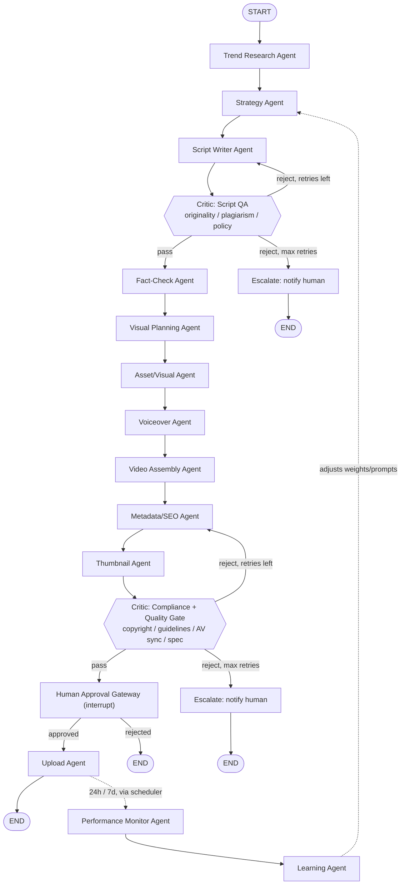
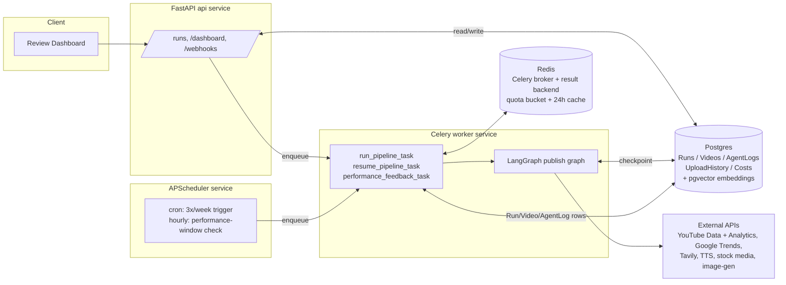

# AutoTube AI

A production-grade multi-agent system that autonomously researches YouTube trends, writes
*original* scripts, produces voiceover/visual/video assets, assembles final videos, generates
thumbnails, and publishes via the YouTube Data API v3 — governed end-to-end by critic/supervisor
agents for quality and policy compliance, with a human-approval gate before anything goes public.

> **Ground rule:** the system only researches existing YouTube content to find trends, gaps, and
> formats. It never copies, re-uploads, or closely imitates another creator's script, footage, or
> transcript. The Script QA critic hard-blocks on similarity/plagiarism before a script can
> proceed.

## Status: every stage has real logic

The full pipeline is wired end-to-end (every node, every DB table, the FastAPI control API +
review dashboard, the Celery worker, the APScheduler cron process) and every agent/critic node
runs real logic, not placeholder data — verified by running the graph through the happy path,
both critic retry loops, escalation, the human-approval interrupt/resume cycle, and the delayed
feedback graph. What's left is not code, it's the operator setting up their own accounts and
credentials — see [Go-live checklist](#go-live-checklist) below.

- **Trend Research Agent** (`graph/nodes/research.py::trend_research_node`) — pulls real YouTube
  "most popular" videos (`tools/youtube.py`, API-key auth), has an LLM cluster them into original
  content angles (never verbatim topics), then scores each candidate on objective, code-computed
  signals (view-count-derived competition, publish-date freshness, Google Trends rising/top query
  hits via `tools/trends.py`).
- **Strategy Agent** (`::strategy_node`) — LLM picks one candidate given channel goals and a real
  past-performance summary pulled from Postgres (`db/crud.py::summarize_recent_performance`,
  injected by `worker/tasks.py` at the Celery-task boundary so graph nodes stay DB-free).
- **Script Writer + Script QA critic + Fact-Check** (`graph/nodes/script.py`) — LLM-drafted script,
  originality gate via pgvector embedding similarity against both prior YouTube transcripts and
  our own back catalog (`tools/embeddings.py`), LLM claim extraction + Tavily-backed verification.
- **Visual Planning + Asset sourcing** (`graph/nodes/visual.py`) — LLM scene plan, Pexels/Pixabay
  stock search with AI image-gen fallback when no stock match exists. Optionally (off by default,
  `ENABLE_AI_VIDEO_BEATS`) the planner may route up to `MAX_AI_VIDEO_BEATS_PER_RUN` standout beats
  to a real text-to-video generation. `AI_VIDEO_PROVIDER` picks the source: `colab` = a free
  offline **Wan2.1-T2V-1.3B** model the operator runs on Google Colab (`colab/wan_video_colab.ipynb`,
  `tools/colab_video.py`) and nothing else; `auto` = that Colab endpoint first, then hosted
  fal.ai → Hugging Face → NVIDIA → Veo (`tools/fal_video.py`, `hf_video.py`, `nvidia_video.py`,
  `veo_video.py`). Any miss falls back to the mascot animation.
- **Voiceover + Video Assembly** (`graph/nodes/audio_render.py`) — real TTS synthesis, MoviePy/
  FFmpeg render with caption burn-in.
- **Metadata/SEO + Thumbnail + Compliance critic** (`graph/nodes/publish.py`) — LLM-driven SEO
  copy and thumbnail candidates, a compliance gate combining a similarity-based copyright-risk
  proxy, an LLM community-guidelines self-check, and AV-sync/spec checks against the actual
  render.
- **Upload** (`::upload_node`) — real resumable `videos.insert` via OAuth (`tools/youtube.py`).
- **Performance Monitor + Learning** (`graph/nodes/feedback.py`, `graph/feedback_graph.py`) — real
  YouTube Analytics API pull (views/likes/comments/retention) per video/window, compared against a
  Postgres-computed baseline across prior published videos; the resulting `PerformanceSnapshot` is
  persisted so the *next* run's Strategy Agent sees it via `summarize_recent_performance`, and the
  numeric `LearningUpdate.strategy_weight_adjustments` it derives are read back into `strategy_node`'s
  prompt as an explicit signal (`crud.latest_strategy_weight_adjustments`). Note: YouTube's public
  Analytics API doesn't expose thumbnail impressions/CTR (that's Studio-UI-only), so those two
  fields are always `0` — a real API limitation, not something unfinished here.
- **PubSubHubbub webhook** (`api/routes/webhooks.py`, `tools/websub.py`) — `POST/GET
  /api/webhooks/youtube` is a real WebSub subscriber: once subscribed (`python -m tools.websub
  subscribe`, auto-renewed by `scheduler/beat.py`), Google's hub pushes channel changes in
  near-real-time — new/updated entries backfill `Video.published_at`, removals fire a CRITICAL
  notification.
- **Notifications** (`tools/notify.py`) — Slack, Telegram, and email are all real; each fires
  independently whenever its own credentials are configured.
- **Shared LLM client** (`core/llm.py`) — tries Anthropic, OpenAI, Groq, then Gemini in order
  (each skipped if unconfigured; Groq/Gemini are free, no card required), structured Pydantic
  output, used by every LLM-driven stage above.

## Go-live checklist

Everything above is real code, and every external call has a genuinely free path — this can run
end-to-end without a credit card. Two things only an operator with their own accounts can do:

1. **Get one LLM provider key.** Tried in order, first one set wins: `ANTHROPIC_API_KEY` ->
   `OPENAI_API_KEY` -> `GROQ_API_KEY` -> `GOOGLE_API_KEY`. The last two are **free, no card
   required**:
   - Groq: https://console.groq.com/keys (Llama 3.3 70B, very fast)
   - Google AI Studio: https://aistudio.google.com/apikey (Gemini 2.0 Flash)

   With none of the four set, every LLM-driven node (research, strategy, script, metadata,
   compliance) fails with `NoLLMProviderConfigured`.
2. **Run the YouTube OAuth flow once, locally:** `python scripts/youtube_oauth_setup.py`. Opens
   your browser, you sign in and approve access to your own channel — free, just requires you to
   click through it once — and it writes `YOUTUBE_REFRESH_TOKEN` / `YOUTUBE_CHANNEL_ID` into
   `.env`. Required for `upload_node` and for the Performance Monitor Agent's Analytics pull. If
   you ran this script before the `yt-analytics.readonly` scope was added, re-run it — the old
   token won't cover analytics calls.

Also needed either way: the **Docker daemon running** (or Postgres+pgvector/Redis reachable
locally) before `docker compose up` / `alembic upgrade head`.

**Free by default, everywhere else too** — no signup needed at all for these, they're already the
default:
- **Voiceover** (`TTS_PROVIDER=edge`) — edge-tts, Microsoft Edge's neural voices, keyless.
- **Images/thumbnails** (`IMAGE_GEN_PROVIDER=pollinations`) — Pollinations.ai, keyless.
- Both automatically fall back to their free path even if you set the paid provider
  (`openai`) but its key is missing or out of credits — see `tools/tts.py` / `tools/image_gen.py`.

Optional, free, not blocking: `PEXELS_API_KEY` / `PIXABAY_API_KEY` (real stock footage/photos
instead of always falling back to AI image-gen — both have free tiers, sign up for either),
`TELEGRAM_BOT_TOKEN`+`TELEGRAM_CHAT_ID` / `SMTP_*` (Slack-only alerting works fine without them).

## Architecture

### Pipeline (supervisor graph + worker + critic agents)



*(Notification Agent runs alongside every stage — Slack/Telegram/email alerts on critic
rejections, escalations, and failures — not shown as a pipeline node since it's cross-cutting.)*

### System components



### Two graphs, deliberately separate

- **Publish graph** (`graph/builder.py`) — the synchronous, per-run pipeline above. Compiled with
  a **Postgres-backed LangGraph checkpointer**, so a crashed worker resumes from the last
  completed node instead of restarting or double-uploading.
- **Feedback graph** (`graph/feedback_graph.py`) — `performance_monitor -> learning`, fired by the
  scheduler at the 24h/7d mark *after* a video is live. Kept separate because it runs on a delay,
  decoupled from the run that published the video.

## Repo layout

```
agents/schemas/   Pydantic I/O models for every worker + critic agent
graph/            LangGraph state, node stubs, supervisor graph, checkpointer
  nodes/          one module per agent group (research, script, visual, audio_render, publish, feedback, escalation)
api/              FastAPI app: control API (/api/runs) + review dashboard (/dashboard)
worker/           Celery app + tasks (executes the graph outside the request/response cycle)
scheduler/        APScheduler process — cron pipeline trigger + hourly performance-window check
db/               SQLAlchemy models, Alembic migrations, CRUD helpers
tools/            External API wrapper clients (YouTube, Trends, Tavily, TTS, stock media,
                  image-gen) + cross-cutting resilience/quota/cache/notify helpers
core/             Settings (pydantic-settings) + structlog config
docker/           Dockerfile (shared by api/worker/scheduler; command differs per service)
```

## Production-grade properties already in place

| Requirement | Where |
|---|---|
| Idempotent, resumable runs | `graph/checkpointer.py` (Postgres checkpointer) + `db.models.Run` per-run row with `stage_status`/`current_stage` |
| YouTube quota management | `tools/quota.py` — Redis token bucket, 10,000 units/day default, per-operation costs, `QuotaExceededError` propagates instead of silently over-spending |
| 24h result caching | `tools/cache.py`, used by `tools/trends.py` |
| Retry + circuit breaker on every external call | `tools/resilience.py` (`tenacity` exponential backoff + jitter, per-provider `CircuitBreaker`) wraps every function in `tools/youtube.py`, `tools/trends.py`, `tools/research.py`, `tools/tts.py`, `tools/stock_media.py`, `tools/image_gen.py` |
| Critic quality gate with bounded retries | `graph/builder.py` conditional edges: `critic_script_qa`/`critic_compliance` loop back up to `MAX_CRITIC_RETRIES` times, then route to `escalate_node` which notifies a human via `tools/notify.py` |
| Structured observability | `core/logging.py` (structlog) — every node call logs a structured event; `graph/state.py`'s `trace` accumulator captures the full run as a JSON timeline, persisted via `db/crud.persist_trace_as_agent_logs` into `AgentLog` |
| Cost tracking | `db.models.Cost` table (one row per stage/provider spend); `agents.schemas.common.StageCost` is the structured shape each node will report once real provider calls are wired in |
| Human-in-the-loop, toggleable | `graph/nodes/publish.human_approval_node` uses LangGraph `interrupt()`; `REQUIRE_HUMAN_APPROVAL=false` swaps in `auto_approve_node` at graph-build time |
| Scheduling decoupled from API | `scheduler/beat.py` is its own process/container, never started inside the FastAPI app |
| Secrets via env only | `core/settings.py` (pydantic-settings) + `.env.example` documents every key; nothing hardcoded |

## Setup

### 1. Prerequisites
- Docker + Docker Compose (recommended path), or Python 3.11+ and local Postgres 16 w/ pgvector + Redis for a bare-metal run.

### 2. Configure secrets
```bash
cp .env.example .env
# fill in: Anthropic/OpenAI keys, YouTube OAuth client + refresh token, Tavily, TTS provider,
# Pexels/Pixabay, image-gen provider, Slack webhook (optional), Postgres/Redis passwords.
```

### 3. Run with Docker Compose
```bash
docker compose up --build
```
This starts `postgres` (pgvector-enabled), `redis`, `api` (runs `alembic upgrade head` then
serves on `:8000`), `worker` (Celery), and `scheduler` (APScheduler, its own process).

- API docs: http://localhost:8000/docs
- Review dashboard: http://localhost:8000/dashboard/

> Note: this repo was scaffolded and verified in an environment without a running Docker daemon
> available for a full container build/integration test. `docker compose config` validates the
> compose file syntactically and `docker compose build api` was confirmed to build correctly;
> the full `docker compose up` integration run should be your first sanity check in an
> environment with Docker actually running.

### 4. Local (non-Docker) dev loop
```bash
python -m venv .venv && source .venv/Scripts/activate   # or .venv/bin/activate on macOS/Linux
pip install -e .
alembic upgrade head            # requires Postgres+pgvector reachable at DATABASE_URL
uvicorn api.main:app --reload
celery -A worker.celery_app worker --loglevel=info   # separate terminal
python -m scheduler.beat                              # separate terminal
```

### 5. Exercise the graph without any external services
The publish graph runs fully in-memory with stub node logic — no DB/Redis/API keys needed:
```python
from langgraph.checkpoint.memory import MemorySaver
from graph.run import start_run, resume_run

cp = MemorySaver()
thread_id, result = start_run(cp, run_id="demo")
# result["__interrupt__"] holds the ApprovalPacket — the human_approval_node paused here
resumed = resume_run(cp, thread_id, {"run_id": thread_id, "approved": True, "reviewer": "me"})
print(resumed["upload_result"])
```
Pass `debug_force_reject={"critic_script_qa": 2}` to `start_run` to exercise the retry loop, or
a value >= `MAX_CRITIC_RETRIES` to exercise escalation — this hook exists purely to validate graph
wiring before real critic logic lands.

## Estimated cost per video

Two cost profiles, depending on which providers you configure:

**Running entirely on free tiers** (Groq or Gemini for every LLM call, edge-tts for voiceover,
Pollinations.ai for images, Pexels/Pixabay for stock, YouTube Data/Analytics API which is
quota-based not billed) — **$0.00/video**, subject to each free tier's rate limits.

**Running on paid providers** (rough, provider-list-price estimates for an ~8-minute long-form
video; short-form videos are a fraction of this):

| Stage | Provider (example) | Est. cost |
|---|---|---|
| Trend research + strategy (LLM calls) | Claude Sonnet / GPT-4o-mini | $0.05 |
| Script writing + revisions (avg. 1.5 attempts) | Claude Sonnet | $0.15 |
| Fact-checking (Tavily searches) | Tavily | $0.02 |
| Voiceover (~1,200 words) | OpenAI TTS | $0.20 |
| Stock visuals (8-10 clips) | Pexels/Pixabay | $0.00 (free tier) |
| AI-generated images (where no stock match) | OpenAI images | $0.08 |
| Thumbnail generation (2-3 candidates) | OpenAI images | $0.06 |
| Metadata/SEO + compliance critic (LLM calls) | Claude Sonnet / GPT-4o-mini | $0.04 |
| YouTube upload | Data API v3 | $0.00 (quota, not billed) |
| **Total (LLM + TTS + image-gen only)** | | **≈ $0.60 / video** |

Not included above: compute (rendering CPU time), Postgres/Redis hosting. At 3 videos/week (the
default cadence) that's roughly **$7-8/month** in variable API spend on the paid path, or $0 on
the free path. `db.models.Cost` is where actual per-run spend gets logged once each tool wrapper
reports real provider costs, so this table can be replaced with measured numbers.

## What's next

All stages have real logic (see [Status](#status-every-stage-has-real-logic) above) and the only
remaining work to run this unattended in production is the three operator steps in the
[go-live checklist](#go-live-checklist). Beyond that, reasonable next investments:

- Replace the estimated cost table with measured `db.models.Cost` numbers once a few real runs
  have logged provider spend.
- Feed `strategy_weight_adjustments` back as a per-key weighting on the candidates' composite
  scores directly (code-side), not only as prompt text for the LLM to weigh.

Recently completed (both former "what's next" items): the numeric
`LearningUpdate.strategy_weight_adjustments` are now read back into `strategy_node` via
`crud.latest_strategy_weight_adjustments`, and `api/routes/webhooks.py` is now a working YouTube
PubSubHubbub subscriber (`tools/websub.py` manages the subscription; `scheduler/beat.py` renews
it).
